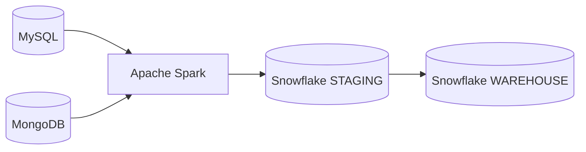
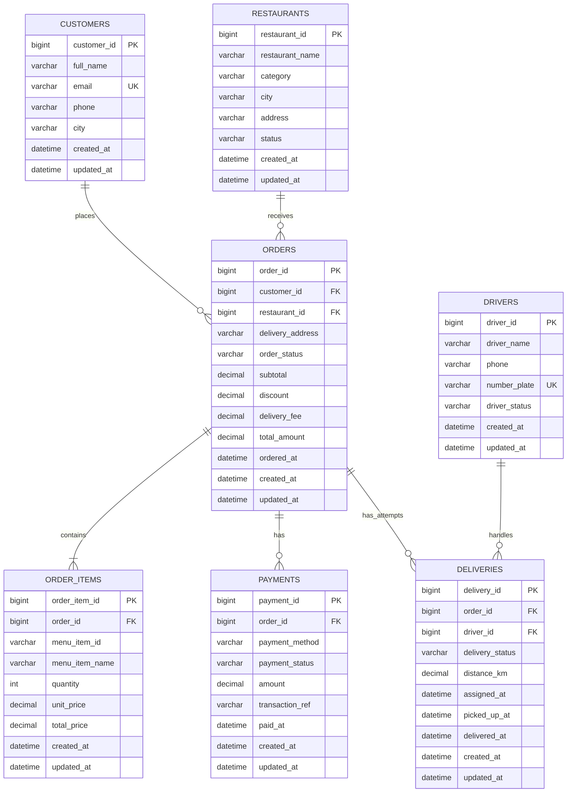
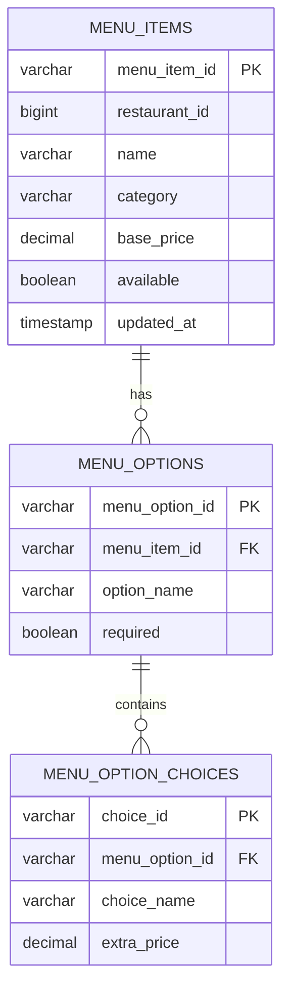
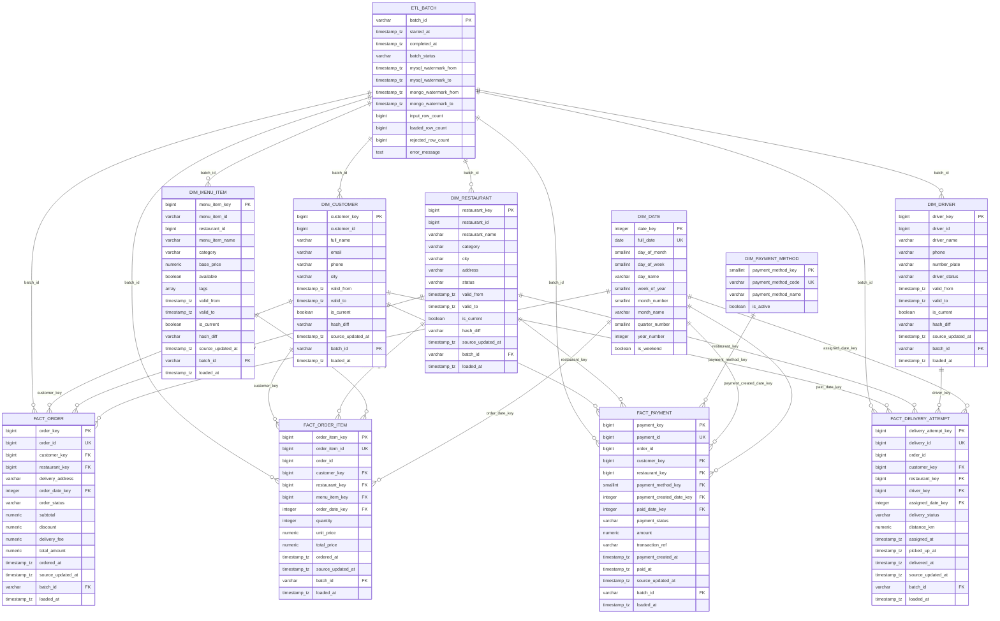

# Food Delivery Batch ETL — Example Database Schema

## Data stack

| Stage | Technology | Responsibility |
|---|---|---|
| Extract | MySQL | Transactional data: customers, restaurants, orders, payments, deliveries |
| Extract | MongoDB | Semi-structured menu catalog and menu options |
| Transform | Apache Spark | Validation, cleansing, flattening, joining, deduplication |
| Load | Snowflake | Columnar analytical warehouse for reporting and BI |



## 1. MySQL source schema

MySQL stores transactional data. Every mutable table includes `created_at` and
`updated_at` so Spark can perform incremental extraction using a watermark.

### Entity relationship diagram



### Cross-source identifier

- `order_items.menu_item_id` references a menu document in MongoDB.
- MySQL cannot enforce a foreign key for this reference. Spark must validate it
  during transformation.
- Phone numbers are required but not unique because a telecom provider may recycle a
  cancelled number for a different customer or driver. Email and number plate
  retain source-level uniqueness.
- `order_items.menu_item_name` and `unit_price` are snapshots of values at the
  time of purchase. `orders.delivery_address` is also an order-time snapshot so
  changing a customer profile cannot rewrite the destination of an old order.

## 2. MongoDB source schema

Collection: `menu_items`

```json
{
  "_id": "MENU-1001",
  "restaurantId": 101,
  "name": "Chicken Burger",
  "description": "Grilled chicken with cheese",
  "category": "Burger",
  "basePrice": 159.00,
  "available": true,
  "tags": ["popular", "chicken"],
  "options": [
    {
      "name": "Size",
      "required": true,
      "choices": [
        {"name": "Regular", "extraPrice": 0},
        {"name": "Large", "extraPrice": 40}
      ]
    },
    {
      "name": "Extra topping",
      "required": false,
      "choices": [
        {"name": "Cheese", "extraPrice": 20},
        {"name": "Egg", "extraPrice": 15}
      ]
    }
  ],
  "createdAt": "2026-07-01T08:00:00Z",
  "updatedAt": "2026-07-19T10:30:00Z"
}
```

Spark flattens the nested document into these logical datasets:



## 3. Snowflake warehouse schema

The target database is `FOOD_DELIVERY_DW`. Spark writes transformed batches to
the `STAGING` schema, and Snowflake SQL merges them into dimensions and facts in
the `WAREHOUSE` schema.

The warehouse uses a fact constellation: four fact tables share conformed
dimensions. Every dimension uses a Snowflake-generated surrogate key, while
the source identifier remains available for tracing records back to MySQL or
MongoDB.



### Snowflake physical design

- `FOOD_DELIVERY_DW.STAGING` contains transient tables. They persist across
  Spark and SQL sessions but can be rebuilt from the source systems, so they do
  not need Snowflake Fail-safe storage.
- `FOOD_DELIVERY_DW.WAREHOUSE` contains permanent standard tables for
  dimensions, facts, and ETL lineage.
- Snowflake standard tables use columnar micro-partition storage. The initial
  design does not define indexes or clustering keys. Clustering should be
  introduced only when production-scale query profiles show excessive scans.
- `NOT NULL` and `CHECK` constraints protect row-level rules. Primary key,
  unique, and foreign key constraints are retained as modeling metadata, but
  Snowflake does not enforce them on standard tables. ETL merge conditions and
  post-load data-quality checks enforce uniqueness and referential integrity.
- `batch_id` remains a 36-character string for compatibility across Spark,
  MySQL, MongoDB, and Snowflake clients.
- Source and audit timestamps use `TIMESTAMP_TZ`. Source values are normalized
  to UTC; `Asia/Bangkok` is applied only when deriving business date keys.
- Spark serializes MongoDB menu tags as JSON text in staging to keep the
  connector write path portable. The dimension parses that JSON into a
  Snowflake `ARRAY`.
- Surrogate keys use Snowflake identity columns. Key `0` is inserted explicitly
  for unknown members, while normal members use generated values.

### Fact table grain

| Fact table | One row represents |
|---|---|
| `fact_order` | One food order |
| `fact_order_item` | One menu item line within an order |
| `fact_payment` | One source payment record and its current lifecycle state |
| `fact_delivery_attempt` | One delivery attempt for an order |

### Dimension history strategy

- `dim_customer`, `dim_restaurant`, `dim_menu_item`, and `dim_driver` use
  Slowly Changing Dimension Type 2. A changed source record creates a new row;
  `valid_from`, `valid_to`, and `is_current` identify its effective period.
- The first version uses source `created_at` as `valid_from`; later versions use
  source `updated_at`. Snowflake merge logic and post-load data-quality checks
  ensure uniqueness on `(source_identifier, valid_from)` and allow only one
  `is_current = true` row per source identifier.
- Version periods use the half-open interval `[valid_from, valid_to)` so two
  versions should never overlap. The current version has `valid_to = NULL`,
  and an overlap check runs after each dimension load.
- `hash_diff` contains a deterministic hash of the tracked business attributes.
  Driver phone changes are tracked and therefore create a new driver version.
  ETL creates a new version only when this hash changes; changes to audit fields
  alone do not create dimension versions.
- `dim_date` and `dim_payment_method` are static reference dimensions and do
  not require history columns.
- Fact rows resolve each surrogate key against the dimension version effective
  at the event timestamp, so later source changes do not rewrite history.

### Key and loading rules

- Event timestamps are stored as `TIMESTAMP_TZ`. Positive `date_key` values use
  `YYYYMMDD` after converting the timestamp from UTC to the warehouse business
  timezone, `Asia/Bangkok`; key `0` is reserved for the unknown date.
- `fact_order_item.ordered_at` and `order_date_key` are derived by joining each
  source order item to its parent order during transformation. Keeping the
  timestamp on the item fact supports hourly menu analysis without joining one
  fact table to another.
- `fact_payment.payment_created_date_key` always derives from source
  `payments.created_at`. `paid_date_key` derives from nullable `paid_at` and
  uses the unknown date member while a payment is pending.
- `order_id` is retained as a degenerate dimension in item, payment, and
  delivery facts. The facts intentionally do not reference `fact_order`, which
  keeps them independently loadable and preserves the star-schema pattern.
- Source event identifiers (`order_id`, `order_item_id`, `payment_id`, and
  `delivery_id`) are unique in their respective fact tables. ETL loads use
  these identifiers for idempotent upserts.
- Every source-driven table stores `source_updated_at`. An upsert may replace a
  fact row only when the incoming source timestamp is newer, preventing a
  replayed or out-of-order batch from overwriting newer data.
- Each dimension has a reserved surrogate key `0` for an unknown or
  late-arriving member. ETL updates the fact foreign key when the real member
  later arrives. Invalid business keys, such as a malformed or nonexistent
  menu item ID, are quarantined instead of being silently mapped to unknown.
- Monetary fields use `NUMERIC(12,2)`; `distance_km` uses `NUMERIC(8,2)`.
  Quantities and monetary values must be non-negative. In the current source,
  `REFUNDED` is a payment lifecycle status and its amount remains positive; a
  separate negative refund transaction requires a dedicated source refund ID
  and timestamp, which are not currently available.
- `etl_batch` stores the status, source watermark ranges, row counts, and error
  details for every Spark run. Each source-driven dimension and fact stores the
  36-character `batch_id` of the batch that last inserted or updated it, plus
  `loaded_at` for lineage and replay audits.
- Static `dim_date` and `dim_payment_method` rows are seeded during warehouse
  initialization and therefore do not require a `batch_id`.
- Snowflake does not use traditional indexes. Its micro-partition pruning is
  monitored first; clustering keys are added only when table size and query
  profiles justify their maintenance cost.

## 4. Incremental extraction fields

| Source | Incremental field | Suggested extraction |
|---|---|---|
| MySQL | `updated_at` | `last_watermark < updated_at <= current_watermark` |
| MongoDB | `updatedAt` | The same half-open watermark pattern |

Each Spark run should create a `batch_id`, store its watermark range, and record
its result. Reprocessing the same batch must not create duplicate warehouse
rows.
