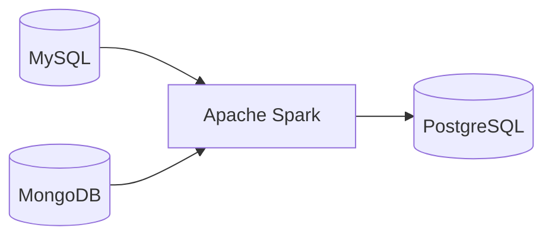
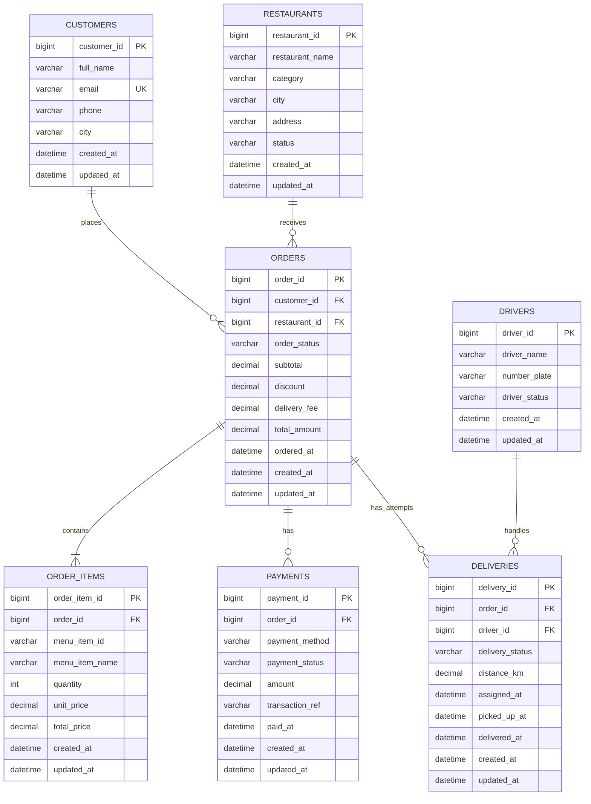
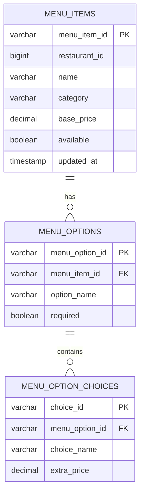
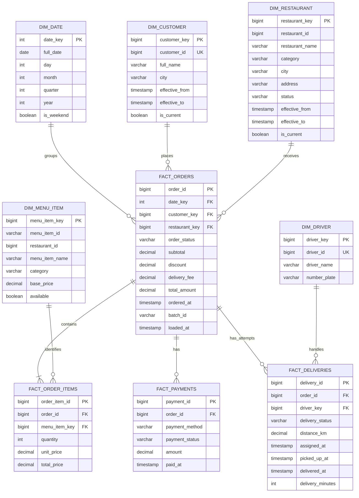

# Food Delivery Batch ETL — Example Database Schema

## Data stack

| Stage | Technology | Responsibility |
|---|---|---|
| Extract | MySQL | Transactional data: customers, restaurants, orders, payments, deliveries |
| Extract | MongoDB | Semi-structured menu catalog and menu options |
| Transform | Apache Spark | Validation, cleansing, flattening, joining, deduplication |
| Load | PostgreSQL | Analytical warehouse for reporting and BI |



## 1. MySQL source schema

MySQL stores transactional data. Every mutable table includes `created_at` and
`updated_at` so Spark can perform incremental extraction using a watermark.

### Entity relationship diagram



### Cross-source identifier

- `order_items.menu_item_id` references a menu document in MongoDB.
- MySQL cannot enforce a foreign key for this reference. Spark must validate it
  during transformation.
- `order_items.menu_item_name` and `unit_price` are snapshots of values at the
  time of purchase.

## 2. MongoDB source schema

Collection: `menu_items`

```json
{
  "_id": "MENU-1001",
  "restaurantId": 101,
  "name": "Chicken Burger",
  "description": "Grilled chicken with cheese",
  "category": "Burger",
  "basePrice": 159.00,
  "available": true,
  "tags": ["popular", "chicken"],
  "options": [
    {
      "name": "Size",
      "required": true,
      "choices": [
        {"name": "Regular", "extraPrice": 0},
        {"name": "Large", "extraPrice": 40}
      ]
    },
    {
      "name": "Extra topping",
      "required": false,
      "choices": [
        {"name": "Cheese", "extraPrice": 20},
        {"name": "Egg", "extraPrice": 15}
      ]
    }
  ],
  "createdAt": "2026-07-01T08:00:00Z",
  "updatedAt": "2026-07-19T10:30:00Z"
}
```

Spark flattens the nested document into these logical datasets:



## 3. PostgreSQL warehouse schema

The target uses a star schema. Surrogate keys are used for dimensions while
source identifiers are retained for traceability.



### Fact table grain

| Fact table | One row represents |
|---|---|
| `fact_orders` | One food order |
| `fact_order_items` | One menu item line within an order |
| `fact_payments` | One payment or refund transaction |
| `fact_deliveries` | One delivery attempt for an order |

## 4. Incremental extraction fields

| Source | Incremental field | Suggested extraction |
|---|---|---|
| MySQL | `updated_at` | `last_watermark < updated_at <= current_watermark` |
| MongoDB | `updatedAt` | The same half-open watermark pattern |

Each Spark run should create a `batch_id`, store its watermark range, and record
its result. Reprocessing the same batch must not create duplicate warehouse
rows.
